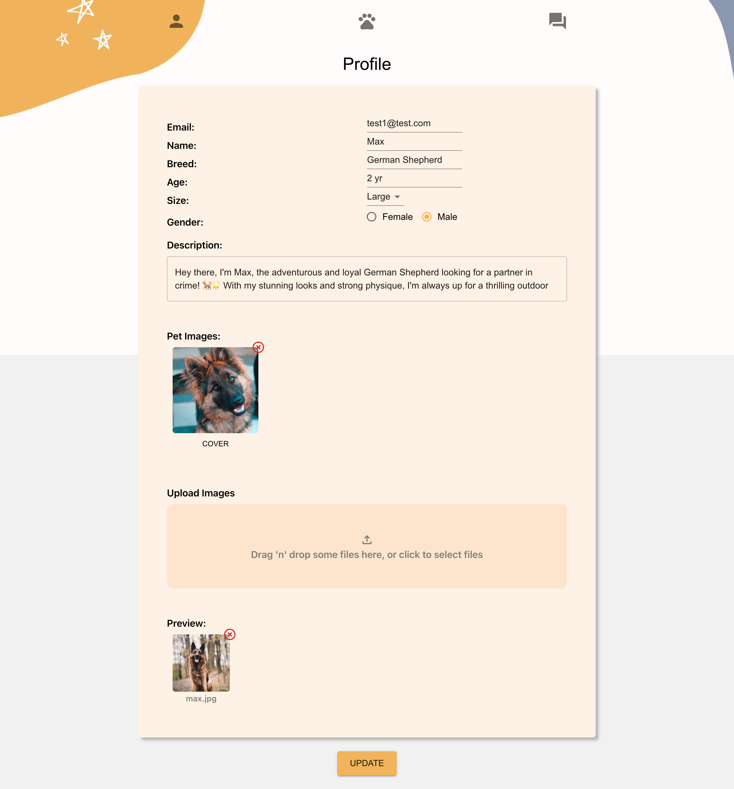

# Dog Tinder - A Canine Connection Platform

## Table of Contents

- [Introduction](#introduction)
- [Demo](#demo)
- [Features](#features)
- [Technologies Used](#technologies-used)
- [Getting Started](#getting-started)
- [Usage](#usage)
- [Contributing](#contributing)
- [License](#license)
- [Acknowledgements](#acknowledgements)

## Introduction

[Dog Tinder](https://dog-tinder-rq.netlify.app) is a web application designed to help dog owners connect with each other, arrange playdates for their furry friends, and share their love for dogs. Whether you're looking for a playmate for your pup or simply want to make friends in the dog-loving community, Dog Tinder is here to facilitate those connections.

This repo contains the front end of the project. The back end of this project is in [repo](https://github.com/RuxinQu/dog-tinder-backend).

## Demo

You can access the deployed website [here](https://dog-tinder-rq.netlify.app)

### Screenshots:

- Home page:
  
- Profile page:
  
- Dashboard page:
  

- Chat page:
  

## Features

- User Registration and Authentication
- Update the user profile and upload user images by dragging and dropping images into the **dropzone**.
- Browse Dog Profiles: Users can view profiles of different dogs and see their details and pictures.
- **Matchmaking**: Users can swipe left or right on dog profiles to express interest and potentially match with other dogs.
- Private **Messaging**: Matched users can chat with each other through the built-in messaging system.

## Technologies Used

### Front-end:

- HTML, CSS, JavaScript
- React.js
- React Cookie: Save user authentication data to cookies
- JSON Web Token
- Formik && Yup: Form validation
- [React Dropzone](https://react-dropzone.js.org)
- [React Tinder Card](https://www.npmjs.com/package/react-tinder-card): A react component to make swipeable elements like in the app tinder

### Back-end:

- Node.js
- Express
- MongoDB
- Mongoose
- Multer && AWS S3

### Deployment:

- Netlify: Front-end deployment
- Heroku: Back-end deployment

## Getting Started

To run Dog Tinder locally, follow these steps:

1. Clone the repository: git clone https://github.com/RuxinQu/dog-tinder.
2. Navigate to the project folder: cd dog-tinder
3. Install the required dependencies: npm install
4. Start the development server: npm start
5. Access the application in your browser at http://localhost:3000.

## Usage

- Create an account or log in to an existing one.
- Browse through different dog profiles by swiping left or right.
- If you and another user both swipe right on each other's profiles, you'll be matched!
- Use the private messaging feature to communicate with your matches.

## Contributing

If you find any bugs or have ideas for new features, feel free to open an issue or submit a pull request.

## License

The Dog Tinder project is licensed under the MIT License.
